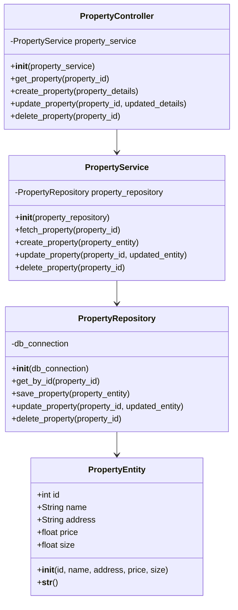

```mermaid
classDiagram
    class PropertyEntity {
        +int id
        +String name
        +String address
        +float price
        +float size
        +__init__(id, name, address, price, size)
        +__str__()
    }

    class PropertyService {
        -PropertyRepository property_repository
        +__init__(property_repository)
        +fetch_property(property_id)
        +create_property(property_entity)
        +update_property(property_id, updated_entity)
        +delete_property(property_id)
    }

    class PropertyRepository {
        -db_connection
        +__init__(db_connection)
        +get_by_id(property_id)
        +save_property(property_entity)
        +update_property(property_id, updated_entity)
        +delete_property(property_id)
    }

    class PropertyController {
        -PropertyService property_service
        +__init__(property_service)
        +get_property(property_id)
        +create_property(property_details)
        +update_property(property_id, updated_details)
        +delete_property(property_id)
    }

    PropertyService --> PropertyRepository
    PropertyController --> PropertyService
    PropertyRepository --> PropertyEntity
```
