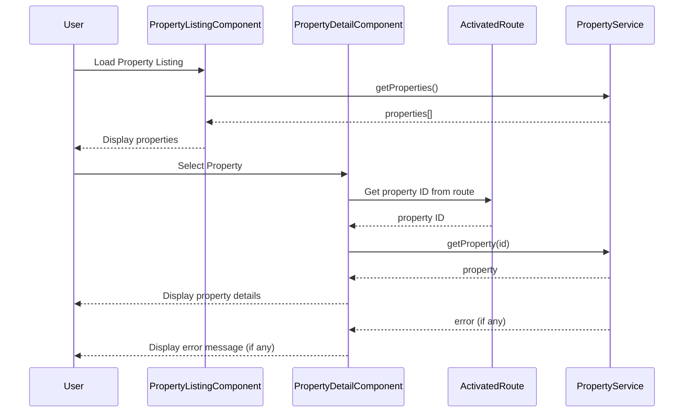

```mermaid
sequenceDiagram
    participant User
    participant PropertyListingComponent
    participant PropertyDetailComponent
    participant ActivatedRoute
    participant PropertyService

    User->>PropertyListingComponent: Load Property Listing
    PropertyListingComponent->>PropertyService: getProperties()
    PropertyService-->>PropertyListingComponent: properties[]
    PropertyListingComponent-->>User: Display properties

    User->>PropertyDetailComponent: Select Property
    PropertyDetailComponent->>ActivatedRoute: Get property ID from route
    ActivatedRoute-->>PropertyDetailComponent: property ID
    PropertyDetailComponent->>PropertyService: getProperty(id)
    PropertyService-->>PropertyDetailComponent: property
    PropertyDetailComponent-->>User: Display property details
    PropertyService-->>PropertyDetailComponent: error (if any)
    PropertyDetailComponent-->>User: Display error message (if any)
```
