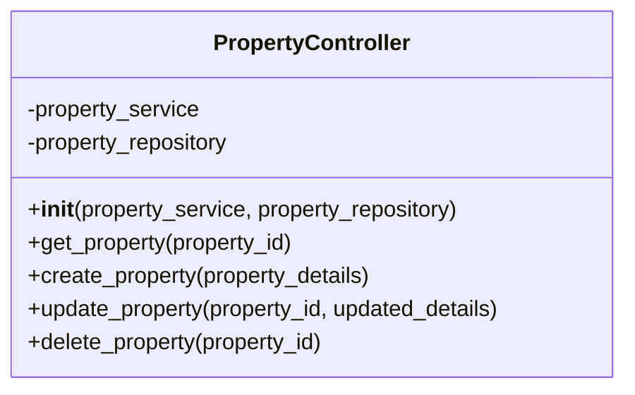

```mermaid
classDiagram
    class PropertyController {
        -property_service
        -property_repository
        +__init__(property_service, property_repository)
        +get_property(property_id)
        +create_property(property_details)
        +update_property(property_id, updated_details)
        +delete_property(property_id)
    }
```
