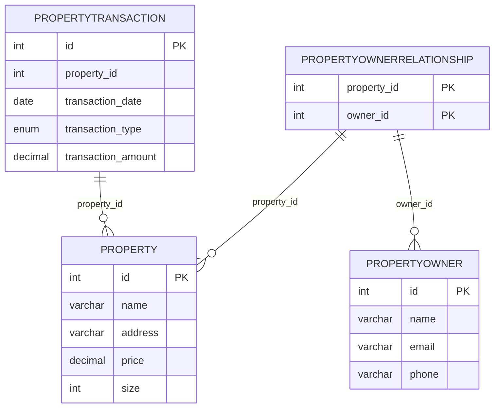

```mermaid
erDiagram
    PROPERTY {
        int id PK
        varchar name
        varchar address
        decimal price
        int size
    }

    PROPERTYOWNER {
        int id PK
        varchar name
        varchar email
        varchar phone
    }

    PROPERTYOWNERRELATIONSHIP {
        int property_id PK
        int owner_id PK
    }

    PROPERTYTRANSACTION {
        int id PK
        int property_id
        date transaction_date
        enum transaction_type
        decimal transaction_amount
    }

    PROPERTYOWNERRELATIONSHIP ||--o{ PROPERTY : "property_id"
    PROPERTYOWNERRELATIONSHIP ||--o{ PROPERTYOWNER : "owner_id"
    PROPERTYTRANSACTION ||--o{ PROPERTY : "property_id"
```
