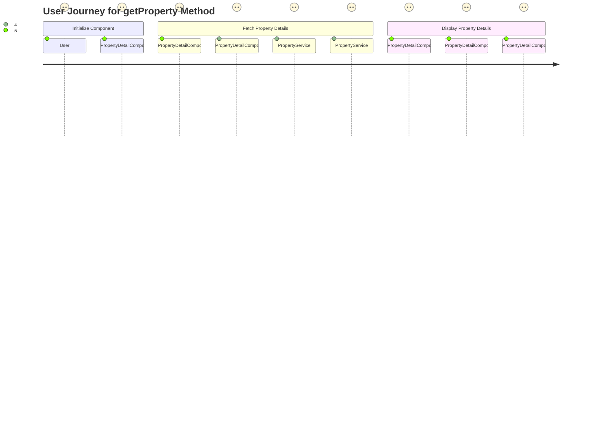

```mermaid
journey
    title User Journey for getProperty Method
    section Initialize Component
      User: Navigates to property detail page: 5: User
      PropertyDetailComponent: Initializes component and calls ngOnInit: 5: PropertyDetailComponent
    section Fetch Property Details
      PropertyDetailComponent: Calls getProperty method: 5: PropertyDetailComponent
      PropertyDetailComponent: Retrieves property ID from route: 4: PropertyDetailComponent
      PropertyService: Fetches property details using getProperty: 4: PropertyService
      PropertyService: Returns property details or error: 4: PropertyService
    section Display Property Details
      PropertyDetailComponent: Receives property details or error: 5: PropertyDetailComponent
      PropertyDetailComponent: Updates property or errorMessage: 5: PropertyDetailComponent
      PropertyDetailComponent: Displays property details or error message: 5: PropertyDetailComponent
```
