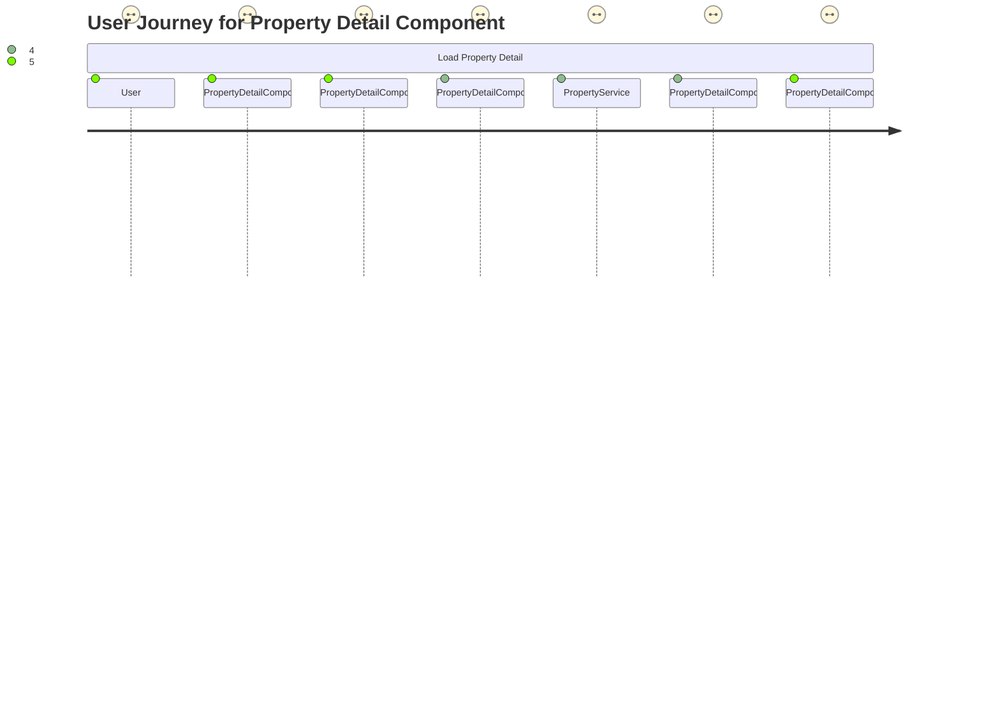

```mermaid
journey
    title User Journey for Property Detail Component
    section Load Property Detail
      User: Clicks on a property listing: 5: User
      PropertyDetailComponent: Initializes component and calls ngOnInit: 5: PropertyDetailComponent
      PropertyDetailComponent: Calls getProperty method: 5: PropertyDetailComponent
      PropertyDetailComponent: Retrieves property ID from route: 4: PropertyDetailComponent
      PropertyService: Fetches property details using getProperty: 4: PropertyService
      PropertyDetailComponent: Receives property details or error: 4: PropertyDetailComponent
      PropertyDetailComponent: Displays property details or error message: 5: PropertyDetailComponent
```
